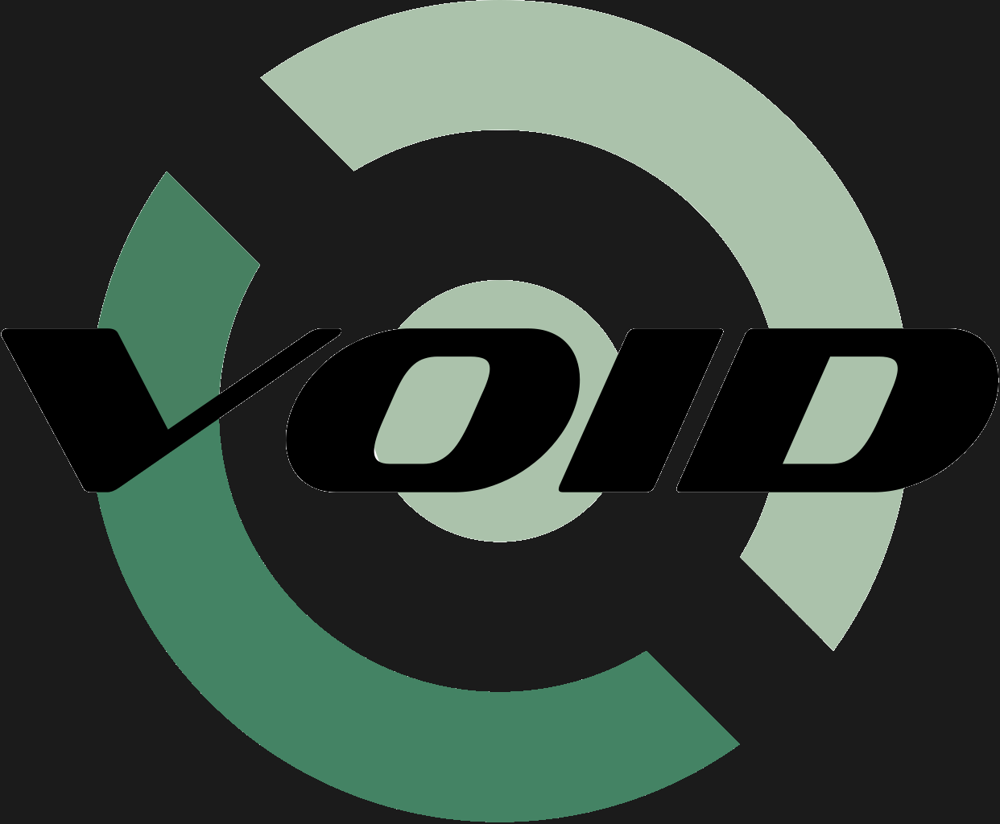

# Void Linux Base Install- My Bootstrap



This is my bootstrap for Void Linux that I plan to deploy on my machine very soon! I haven't tested this out yet, so buyer beware! It's planned to be used on a machine with a fresh Void Linux Base install with nothing but git installed (for pulling down my files). Here's the contents:

### Applications

1. Firefox
2. Alacritty
3. feh
4. Zathura

### Desktop Environment

1. Xorg Server
2. bspwm
3. sxhkd
4. Compton
5. Polybar
6. Pywal
7. PulseAudio

### Terminal Tools

2. xdg-user-dirs
3. neofetch (for that sweet sweet /r/unixporn karma)
4. Neovim
5. Zsh
6. Oh-My-Zsh
7. Fzf

### Running

All you need to do is go into a subdirectory of your $HOME and

```
git clone https://github.com/samueltwallace/void-minimal-bootstrap.git
cd void-minimal-bootstrap
bash main.sh
```

During part of the installation, you *should* make Zsh your default shell.

Forking encouraged! 
=======
1. Texlive
2. Python3
3. Julia programming language
